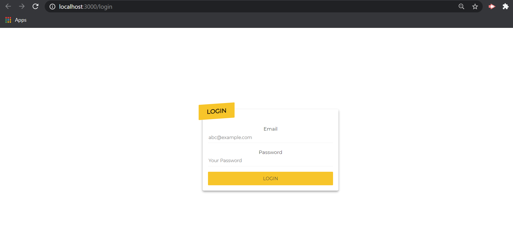
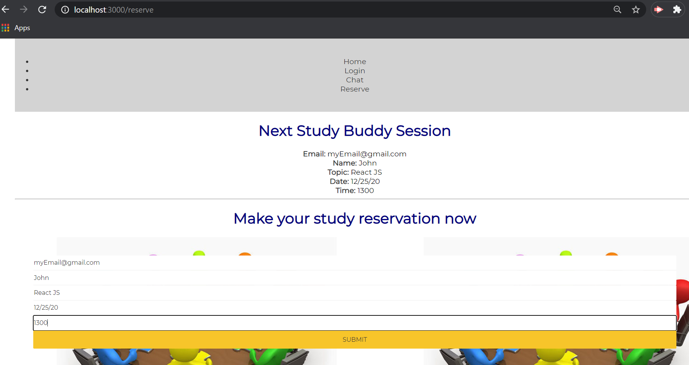
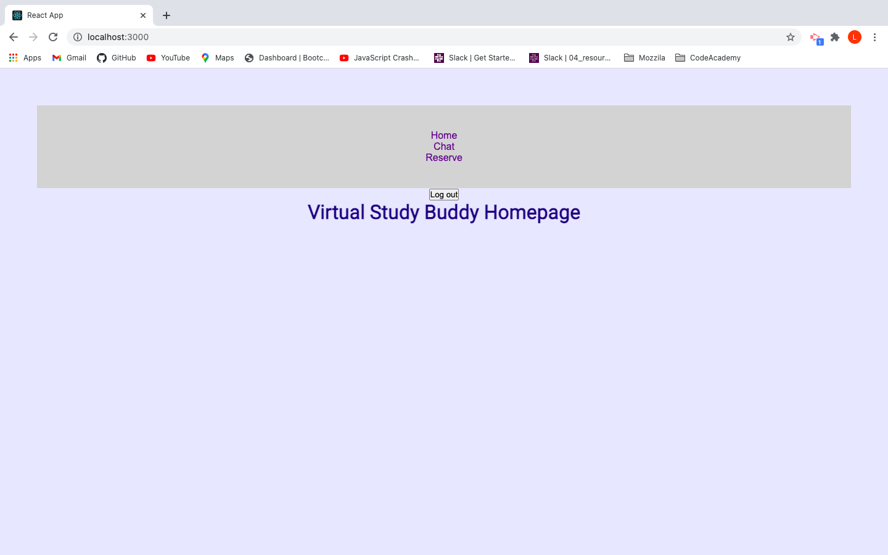

# Studdy-Buddy

## User Story
AS A remote learning student I WANT to be able to interact with other remote learning students in a focused manner via study group booking and messaging SO THAT I can gain further proficiency in the topic of study.

Description: The Study Buddy app solves the real world problem of finding other students for a live chat session. As members of a new virtual bootcamp program we recognized the need to find other current students who are up for a live study session. We also recognize that students may want to reserve future study sessions if they aren't available for the live chat. The app integrates React JS and Socket.io to live chat . The  motivation to build this project was to help students achieve success by having an accessible website that is easy to navigate. Having chat functionality is paramount to our application's success. Remote learning students may be weak in some class content areas but strong in others. Focused collaboration will help students fill in knowledge gaps for each other. A student would benefit greatly from being able to use this application and share that knowledge.

Technologies used: React JS, Node, Express, Socket.io, AuthO, and MongoDB. 

Challenges:  Learning new technologies like socket.io and AuthO. Merging the frontend and backend was quite a challenge so as of now the app deploys on a front and back localhost (3000 and 8000 respectively). 

Future development: Merged deployment, Heroku deployment, Live video chatting, creating tasks list, ability to create and drive/upload files, reservation persistance/editing,  and reservation reminders.  

Installation: clone repo

   Front: npm install, npm i axios, npm i socket.io-client, npm start

   Back: npm install, npm i socket.io, mongod, npm start

   Login : npm install npm i @auth0/auth0-react
   Create or login https://auth0.com/ 
   Create app and setup Allowed Callback URLs, Allowed Logout URLs and Allowed Web Origins by hitting the settings tab.
   Create .env file and enter your REACT_APP_AUTH0_DOMAIN and
   REACT_APP_AUTH0_CLIENT_ID value which you can find in the setting tabs.

Run: Using Chrome or a favorite browser copy link
    Front: https://localhost:3000/ 
    Back: https://localhost:8000/

Deployed: deploy locally 

Page Navigation:

   Frontend: localhost:3000/reserve, localhost:3000/login, localhost:3000/chat
    
   Backend: localhost:8000/ (ideally run in a separate VScode session)

GitHub repo: https://github.com/cyraneous/Project-3-Study-Buddy-4

Authors and acknowledgment: Developed by Melanie Cisler, Cyrus Hanson, Ryan Tervo, Liban Esse, Yusuf Sharif 
